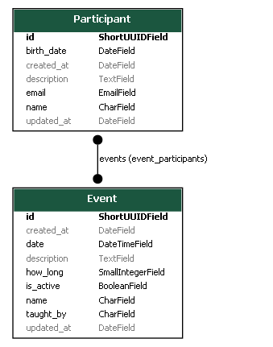

<h1 align="center">
    
</h1>

<h4 align="center">
    Event QR Code
</h4>

## 🚀 Tecnologias
Esse projeto foi desenvolvido com as seguintes tecnologias:

- [Python](https://www.python.org/)
- [Django](https://www.djangoproject.com/)

## 💻 Projeto
**Projeto para gerar QR Code de participantes e registrar participação em eventos. Ideal para usar com celular e ler QR Code. Salva informações dos eventos em que o participante esteve presente.**
<div align="center">
    
</div>
<p align="center">Models</p>
<hr>


### Run
```sh
# clonar repositório
git clone https://github.com/andre23arruda/event-qr-code

# Entrar na pasta
cd event-qr-code

# Renomear env_example.py para env.py
cp setup/env_example.py setup/env.py

# Criar um ambiente virtual
python -m venv venv

# Ativar o ambiente virtual
. activate.sh
# ou . venv/Scripts/activate
# ou . venv/bin/activate
# ou source venv/Scripts/activate

# Instalar os pacotes necessários
pip install -r requirements.txt

# Executar as migrações
python manage.py migrate

# Criar superusuário (poderá fazer login e entrar no admin)
. create_su.sh
# username -> dev
# password -> 123

# Carregar fixtures (exemplo para colocar no banco de dados)
python manage.py loaddata data

# Gerar qr codes
python manage.py generate_codes

# Start
. run.sh
```

## Agora leia um dos QR Codes gerados e teste a aplicação

## Acesse __/admin__ para cadastrar __Eventos__ e __Participantes__

## Explore ou altere do jeito que achar melhor!!
